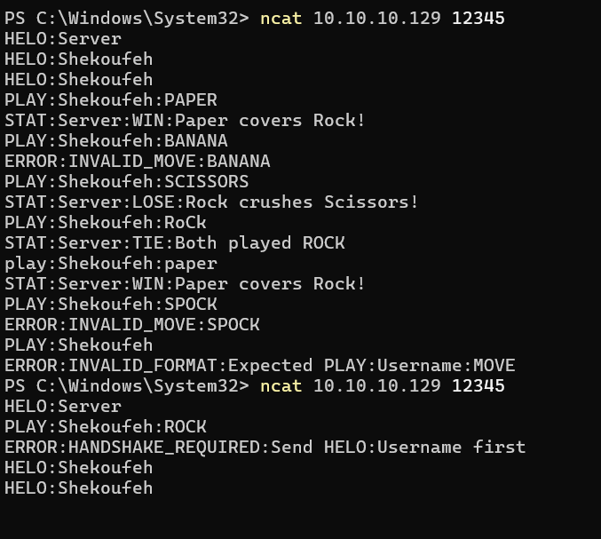
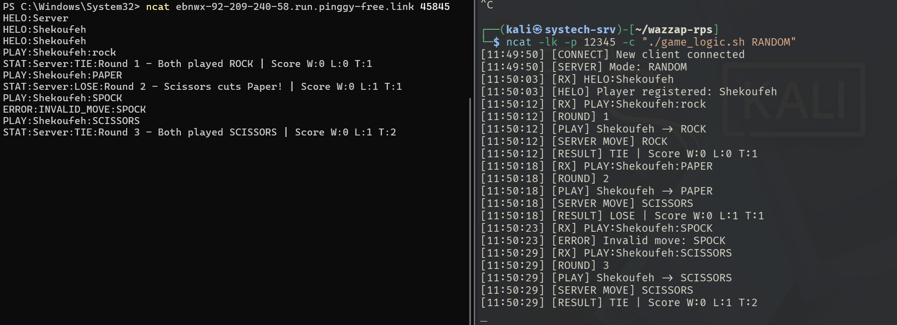
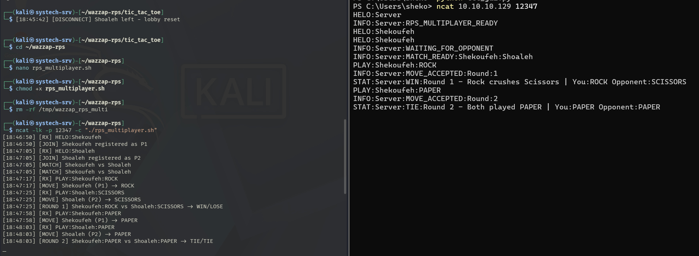
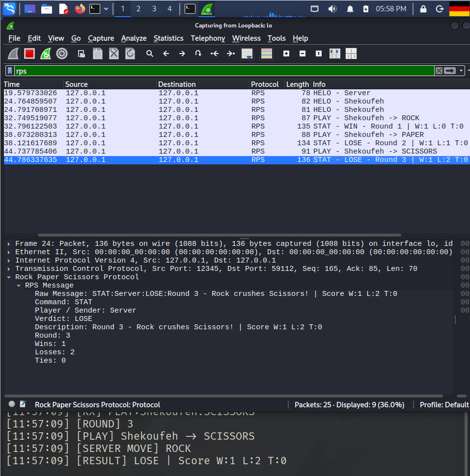
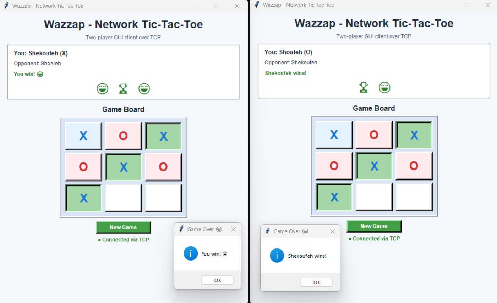
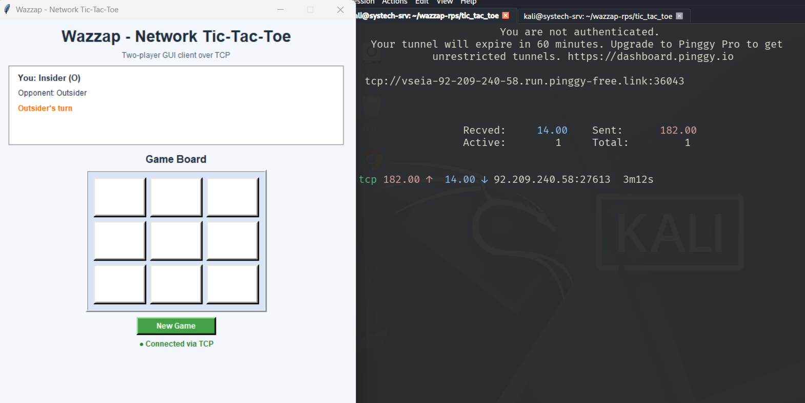

# Wazzap — Network Rock Paper Scissors

A real-time networking project built primarily with Bash and Ncat on Kali Linux.

The project implements a custom application-layer protocol for Rock Paper Scissors (RPS), public TCP tunneling through Pinggy, a custom Wireshark Lua dissector, multiplayer matchmaking using file-based inter-process communication (IPC), and a bonus two-player Tic-Tac-Toe game with a Python/Tkinter GUI.

## Features

- Bash-based Rock Paper Scissors server
- Ncat TCP networking
- Custom text-based application-layer protocol
- Fixed server moves: ROCK, PAPER, or SCISSORS
- Random server move mode
- Input validation and error handling
- Case-insensitive move handling
- Handshake validation
- Round counter and session scoreboard
- Public TCP access through Pinggy
- Custom Wireshark Lua dissector
- Two-player RPS matchmaking
- File-based IPC through `/tmp`
- Two-player Tic-Tac-Toe server written in Bash
- Shared Tic-Tac-Toe game state using file-based IPC and `flock`
- Python/Tkinter Tic-Tac-Toe GUI client
- Remote Tic-Tac-Toe access through Pinggy
- Turn synchronization
- Win and tie detection
- Winning-cell highlighting
- New Game support

## Repository Structure

    wazzap-rps/
    ├── game_logic.sh
    ├── rps_multiplayer.sh
    ├── rps_dissector.lua
    ├── tic_tac_toe/
    │   ├── tic_tac_toe.sh
    │   ├── start_ttt_server.sh
    │   └── ttt_gui.py
    ├── screenshots/
    │   ├── rps-local-validation.png
    │   ├── rps-pinggy-session.png
    │   ├── rps-multiplayer.png
    │   ├── rps-wireshark-dissector.png
    │   ├── tic-tac-toe-win.png
    │   └── tic-tac-toe-pinggy.png
    └── README.md

## RPS Protocol

The RPS protocol uses newline-delimited messages. Message fields are separated using colons.

| Message | Format | Example | Purpose |
|---|---|---|---|
| Handshake | `HELO:Username` | `HELO:Alice` | Registers the player |
| Play | `PLAY:Username:MOVE` | `PLAY:Alice:ROCK` | Submits a move |
| Result | `STAT:Server:VERDICT:Description` | `STAT:Server:WIN:Paper covers Rock` | Returns the game result |
| Error | `ERROR:Type:Description` | `ERROR:INVALID_MOVE:SPOCK` | Reports invalid input |

Valid RPS moves are:

- `ROCK`
- `PAPER`
- `SCISSORS`

The possible verdicts are:

- `WIN`
- `LOSE`
- `TIE`

## RPS Server

The main RPS server logic is implemented in `game_logic.sh`.

Ncat acts as the TCP socket broker and launches the Bash script for each connection.

### Fixed Server Move

Example with ROCK:

    ncat -lk -p 12345 -c "./game_logic.sh ROCK"

The server can also use PAPER or SCISSORS:

    ncat -lk -p 12345 -c "./game_logic.sh PAPER"

    ncat -lk -p 12345 -c "./game_logic.sh SCISSORS"

### Random Server Mode

An additional RANDOM mode selects a new server move for every round:

    ncat -lk -p 12345 -c "./game_logic.sh RANDOM"

### Connect from a Client

From another machine:

    ncat <KALI_IP> 12345

Example protocol exchange:

    HELO:Alice
    PLAY:Alice:ROCK

The server validates the handshake, username, command format, and move before evaluating the round.

## Input Validation

The server handles malformed or unexpected input without immediately terminating the session.

Examples include:

    ERROR:HANDSHAKE_REQUIRED:Send HELO:Username first

    ERROR:INVALID_MOVE:SPOCK

    ERROR:INVALID_FORMAT:Expected PLAY:Username:MOVE

Moves are normalized to uppercase, so inputs such as:

    rock
    Rock
    ROCK

are treated as the same move.

## Round Counter and Scoreboard

The enhanced RPS server maintains a session round counter and tracks:

- Wins
- Losses
- Ties

Example response:

    STAT:Server:WIN:Round 1 - Paper covers Rock! | Score W:1 L:0 T:0

## RPS Multiplayer Bonus

`rps_multiplayer.sh` implements live two-player Rock Paper Scissors matchmaking.

Ncat creates a separate Bash process for every connected client. Because the processes do not share memory, the server uses files under `/tmp` for inter-process communication.

Start the multiplayer server:

    ncat -lk -p 12347 -c "./rps_multiplayer.sh"

Two clients can then connect to:

    ncat <KALI_IP> 12347

The multiplayer implementation includes:

- Player 1 and Player 2 registration
- Lobby management
- Matchmaking
- Shared state through `/tmp`
- Player move synchronization
- Separate player move files
- WIN / LOSE / TIE evaluation
- Player-specific results
- Cleanup between rounds

Example:

    INFO:Server:MATCH_READY:Shekoufeh:Shoaleh

    PLAY:Shekoufeh:ROCK

    PLAY:Shoaleh:SCISSORS

Player 1 receives:

    STAT:Server:WIN:Round 1 - Rock crushes Scissors | You:ROCK Opponent:SCISSORS

Player 2 receives:

    STAT:Server:LOSE:Round 1 - Rock crushes Scissors | You:SCISSORS Opponent:ROCK

## Public TCP Access with Pinggy

Pinggy is used to expose the local TCP server through a temporary public TCP endpoint.

### RPS Tunnel

    ssh -p 443 -R0:127.0.0.1:12345 tcp@free.pinggy.io

Pinggy returns a public hostname and port.

A remote client can connect using:

    ncat <PINGGY_HOSTNAME> <PINGGY_PORT>

This allows the RPS server running inside the Kali VM to be reached from outside the local network.

## Wireshark Lua Dissector

`rps_dissector.lua` implements a custom Wireshark dissector for the RPS application-layer protocol.

The Lua dissector identifies RPS messages transported over TCP port `12345` and extracts structured protocol fields.

Parsed fields include:

- Command
- Player / Sender
- Move
- Verdict
- Description
- Error type
- Round
- Wins
- Losses
- Ties
- Raw message

### Install the Lua Plugin

Copy the dissector to the personal Wireshark Lua plugin directory:

    mkdir -p ~/.local/lib/wireshark/plugins/

    cp rps_dissector.lua ~/.local/lib/wireshark/plugins/

Restart Wireshark after copying the file.

The custom display filter is:

    rps

The protocol is then displayed as `RPS` in the Wireshark Protocol column.

## Tic-Tac-Toe Bonus

A second network game mode was implemented as an additional bonus.

The Tic-Tac-Toe server is written in Bash and supports two simultaneous players.

The shared multiplayer game state is stored under:

    /tmp/wazzap_ttt

`flock` is used to synchronize access to the shared state between the separate Ncat processes.

### Start the Tic-Tac-Toe Server

    cd tic_tac_toe

    ./start_ttt_server.sh

The launcher:

- Stops an old server if necessary
- Removes stale lobby state
- Starts a fresh server
- Listens on TCP port `12346`

The Tic-Tac-Toe server can also be started directly with:

    ncat -lk -p 12346 -c "./tic_tac_toe.sh"

## Tic-Tac-Toe Protocol

The Tic-Tac-Toe mode uses messages including:

    JOIN:Username

    MOVE:Username:1-9

    WELCOME:Username:X

    START:Player1:X:Player2:O

    BOARD:---------

    TURN:Username

    RESULT:WIN:Username

    RESULT:TIE:None

The server coordinates the turns and evaluates all eight possible winning lines.

## Tic-Tac-Toe GUI

An optional Python/Tkinter GUI client was developed as an additional usability enhancement.

Run the GUI on Windows:

    python ttt_gui.py

The GUI provides:

- Server hostname/IP input
- TCP port input
- Player name input
- Two-player networking
- Automatic X/O assignment
- Synchronized game board
- Turn indication
- Colored X and O symbols
- Win detection
- Tie detection
- Winning cells highlighted in green
- Winner notification
- New Game button
- TCP connection status

The required server-side logic remains implemented in Bash; Python is used only for the optional GUI client.

## Remote Tic-Tac-Toe through Pinggy

The Tic-Tac-Toe server can also be exposed through Pinggy.

Start the public TCP tunnel:

    ssh -p 443 -R0:127.0.0.1:12346 tcp@free.pinggy.io

Pinggy returns a public endpoint similar to:

    tcp://example.run.pinggy-free.link:36043

In the GUI, the remote player enters:

    Server IP: example.run.pinggy-free.link
    Port: 36043

This allows one player to connect locally while another player connects through the public Pinggy tunnel.

## Demonstration

### RPS Local Validation

The local test demonstrates successful gameplay, case-insensitive input, invalid-move detection, malformed-message handling, and handshake validation.

### RPS over Pinggy

The RPS server was successfully accessed through a public Pinggy TCP tunnel. The enhanced RANDOM mode, round counter, scoreboard, and error handling are visible in the session.

### RPS Multiplayer Matchmaking

Two independent Ncat clients were matched through the multiplayer server. The Bash processes exchange player and move information using shared files under `/tmp`.

### Custom Wireshark RPS Dissector

The Lua dissector recognizes the custom application protocol as `RPS` and extracts structured fields from the TCP payload, including the verdict, round number, and session score.

### Two-Player Tic-Tac-Toe GUI

Two GUI clients communicate with the Bash server over TCP. Both clients receive synchronized game state and the winning cells are highlighted when the game finishes.

### Remote Tic-Tac-Toe over Pinggy

The Tic-Tac-Toe server was also exposed through a public Pinggy TCP endpoint, allowing a remote GUI client to participate in the same game lobby.

## Ports

| Service | Port |
|---|---:|
| Main RPS server | `12345` |
| Tic-Tac-Toe server | `12346` |
| Multiplayer RPS server | `12347` |

## Technologies

- Bash
- Ncat
- TCP
- Pinggy
- Wireshark
- Lua
- Python
- Tkinter
- File-based IPC
- `flock`

## Author

Shekoufeh Neisarian
